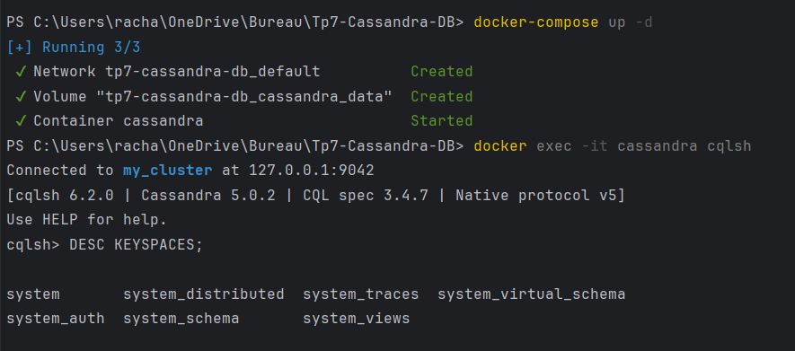
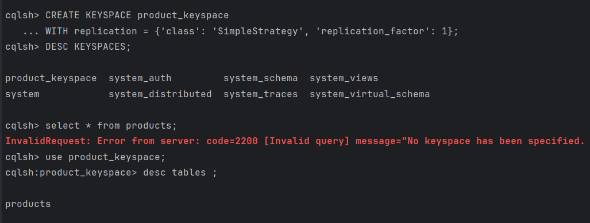
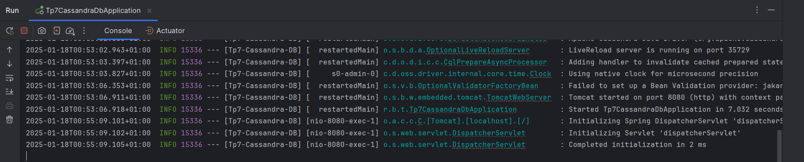
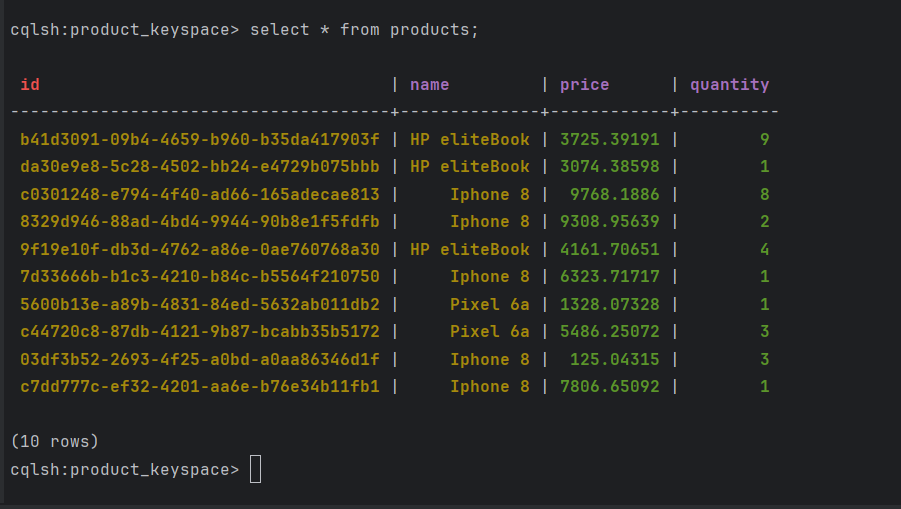
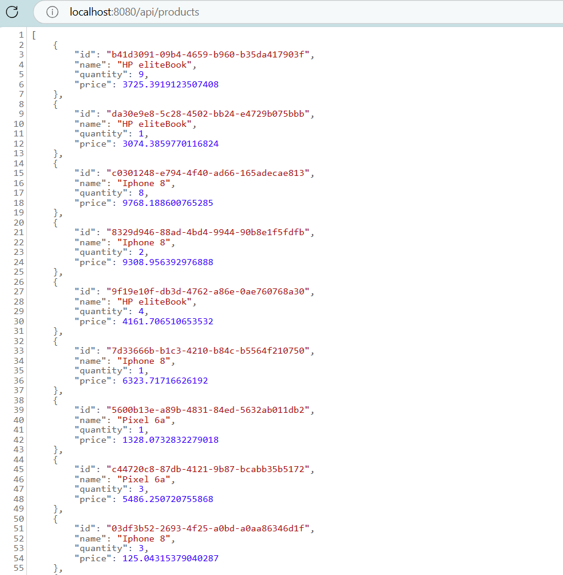
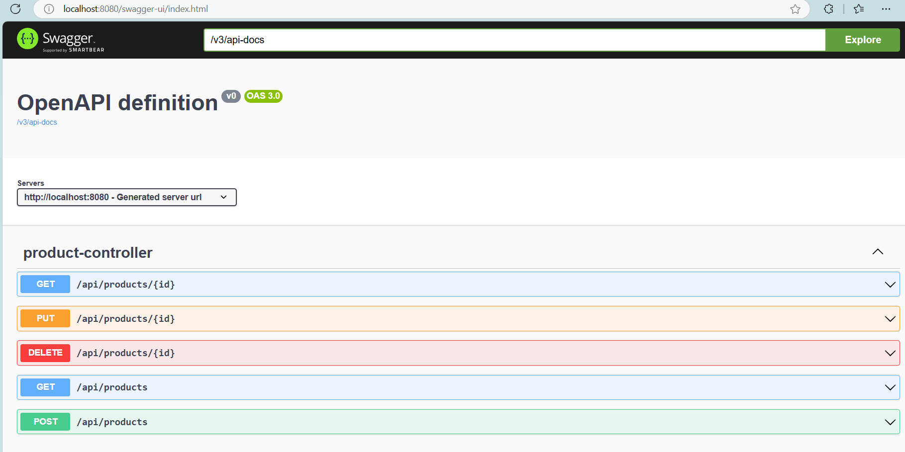
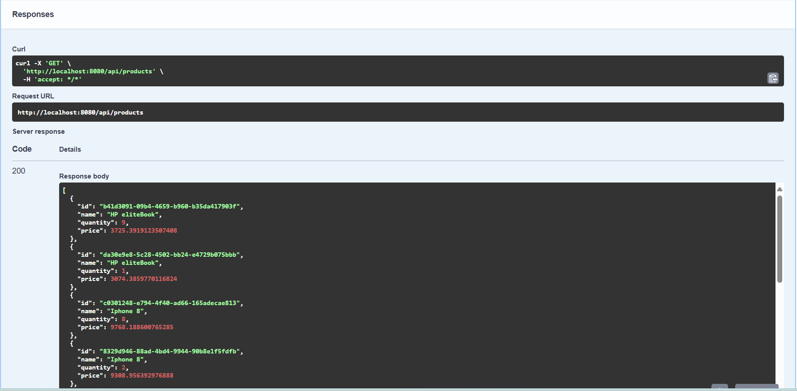

# Cassandra avec Spring 

Ce projet est une application Spring Boot qui réalise des opérations CRUD (Create, Read, Update, Delete) pour gérer les produits stockés dans une base de données Cassandra.

## Prérequis

Avant de commencer, assurez-vous d'avoir les outils suivants installés sur votre système :

- [Java JDK 17+](https://www.oracle.com/java/technologies/javase-jdk17-downloads.html)
- [Apache Maven](https://maven.apache.org/)
- [Docker](https://www.docker.com/)
- [Postman](https://www.postman.com/) (facultatif, pour tester l'API)

## Installation

1. Clonez le projet depuis le dépôt Git :

   ```bash
   git clone https://github.com/BarbaraRacha/Tp-Cassandra-DB.git
   cd Tp7-Cassandra-DB
   ```

2. Lancez la base de données Cassandra avec Docker à l'aide du fichier `docker-compose.yml` :

   ```bash
   docker-compose up -d
   ```

   Cette commande démarre une instance Cassandra à laquelle l'application pourra se connecter.

3. Ajouter les requetes affichées sur les screens pour configurer la base de données cassandra.



4. Configurez l'application dans `application.yml` pour vous connecter à Cassandra (assurez-vous que les informations de connexion correspondent à celles définies dans `docker-compose.yml`).
```
spring.application.name=Tp7-Cassandra-DB

spring.cassandra.local-datacenter=datacenter1
spring.cassandra.contact-points=127.0.0.1
spring.cassandra.port=9042
spring.cassandra.keyspace-name=product_keyspace
spring.cassandra.schema-action=CREATE_IF_NOT_EXISTS
spring.cassandra.request.timeout=10s
spring.cassandra.connection.connect-timeout=10s
spring.cassandra.connection.init-query-timeout=10s

```

5. Compilez et lancez l'application Spring Boot :


## Fonctionnalités

L'application offre les fonctionnalités suivantes :

- Ajouter un produit
- Consulter la liste des produits
- Modifier un produit
- Supprimer un produit

## Résultats

### Sur Console: 


### Sur Web: 



### Sur Swagger UI

Accédez à l'interface Swagger pour tester les endpoints de l'API à l'adresse suivante :

```
http://localhost:8080/swagger-ui.html
```

L'interface Swagger vous permet d'explorer et de tester les fonctionnalités CRUD de manière interactive.



### Exemple d'Affichage des produits



## Structure du projet

Voici une vue d'ensemble de l'architecture du projet :

```
Tp7-Cassandra-DB
├── src
│   ├── main
│   │   ├── java
│   │   │   └── racha.barbara.tp7cassandradb
│   │   │       ├── helpers
                  └── ProductFactory
│   │   │       ├── repositories
                  └── ProductRepository
│   │   │       ├── services
                  └── ProductService
│   │   │       ├── tables
                  └── Product
│   │   │       └── web
                  └── ProductController
│   │   ├── resources
│   │       ├── application.yml
├── target
├── docker-compose.yml
├── pom.xml
├── README.md
└── images
```

---

**Auteur :** Racha

Pour toute question, n'hésitez pas à me contacter !
